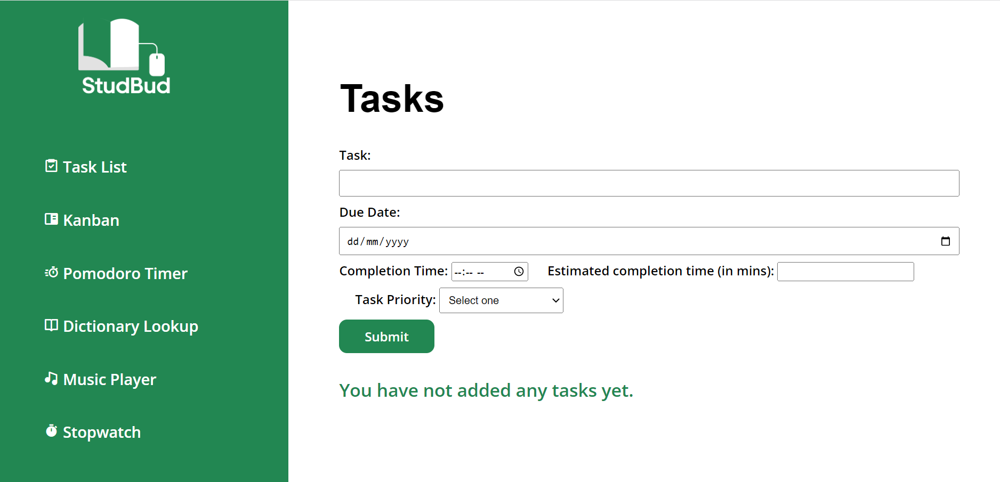
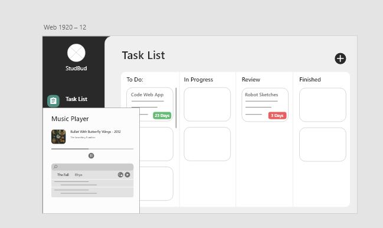
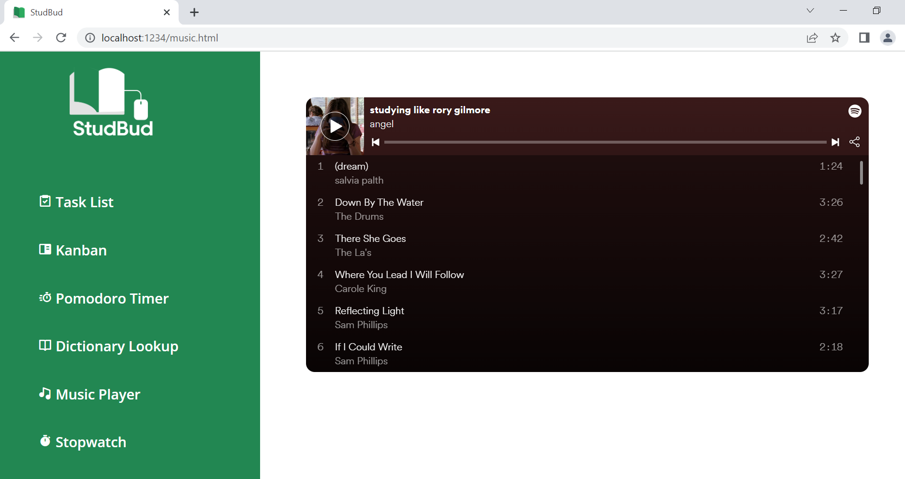
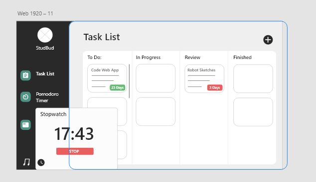
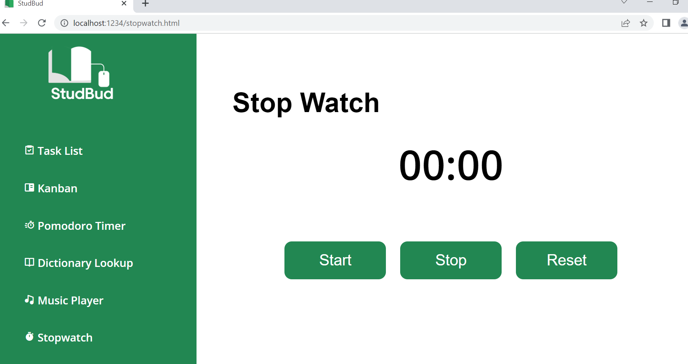
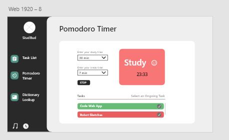
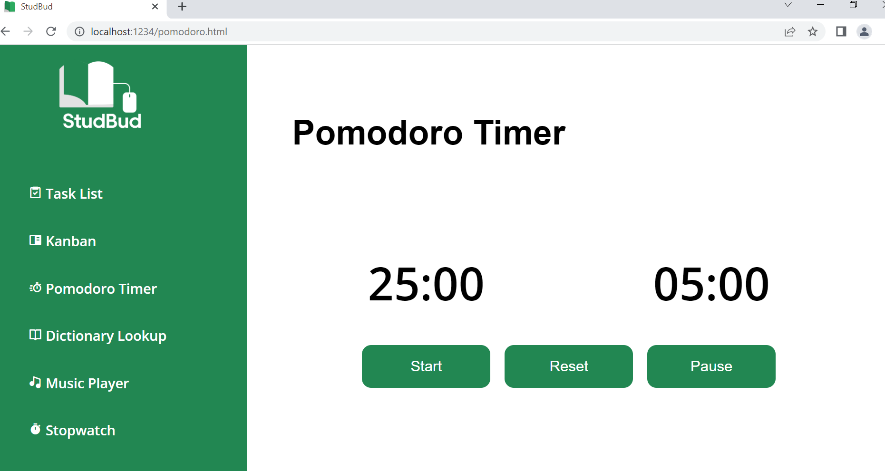
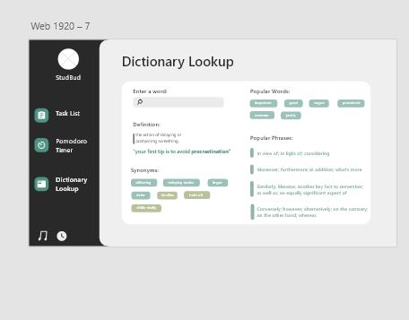
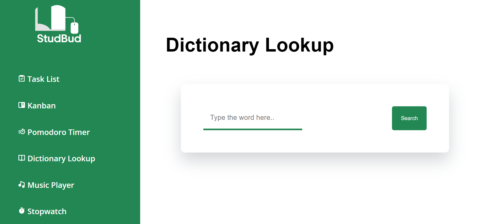

ipow3496    Isak Powell
# StudBud    ipow3496

**NOTE:** It says mgor3944 because he was attempting to fix my package files for my server in Week 6. However, we ended up using Drews repo instead, so ignore his name connected to my repo.

Overall my StudBud study web app had a variety of changes compared to my mockups. This was for a variety of reasons, such as **productivity, minimizing distractions, aesthetics and my coding sufficiency.**

## **Key changes from mockups:**

* Separating the ‘Task List’ and ‘Kanban Board’ into separate components for **the key purpose of flexibility of adding tasks**. e.g. The Task List is for short-term tasks, Kanban Board is for long-term tasks.
* Changing pop up stopwatch and music player to separate pages for the **key purpose of minimizing distractions**
* Various aesthetical changes from mockups, mainly due to my css coding abilities, and me rethinking the aesthetic design
* New **resposive** navigation panel and overall a new aesthetic

## Task List

My StudBud task list records the input into multiple text and selection fields such as:

* Date of task created
* Task completion date
* Estimated task time
* Task Priority

Rob Dongas helped a lot on canvas with his example code. **This helped me with the Javascript** (Dongas, 2022)

**NOTE:** A key design decision is that my task list purposely **does not save inputs to local storage.** This is because the task list is only meant for extremely short-term tasks for that single study session.

### Changes from Mockups:
A major change from my mockups is that I separated the kanban and task list into two separate parts. I mainly did it for two reasons. One being that this provided the user an option for listing miscellaneous tasks without being forced to organize them, and two because of my lack of cohesive JS coding knowledge and this method was simpler to execute.

**New Task List Implementation:**

## Music Player
A major help to me in creating this music player was Spotify’s embedded music player (Spotify, 2022). This proved extremely useful. A key design decision is my music player does not have access to searchability, because of the **key reason to minimize distractions.** Another key reason for me using an embedded music player is that it is **extremely lightweight**, making it appropriate for my web app because it has all the functionality that it needs.

### Changes from mockups:
A major change from my mockups is that I didn't make my music player **pop up, instead I made it on a separate page**. I did this for the key reason of the music player being **extremely distracting to users**, thus I made the decision to put it on a separate page, but enable it to still play even when you move off that page.

Mockup: 

New:

## Stop Watch

My stopwatch was generally the exact same from my mockups, however similarly to my music player, it was not pop up, and also on a separate page. I had massive help from an online tutorial which guided me through the **Javascript** (Tirri, 2020).

Mockup:

New:

## Pomodoro Timer

I found the JS very difficult in the Pomodoro Timer, however, there was this fantastic youtube video which helped me. This was a major help in my **JavaScript** (Learn-webdev, 2020).

### Changes from mockups:
A major change from my pomodoro timer from my mockups was that I removed the feature of being able to change the length of your study time and break time. This was because of the key reason that if you could change your break and study time lengths, it would totally **destroy the whole idea and effectiveness of the pomodoro technique.** It would allow people to abuse the pomodoro timer, thus lowering users productivity.

Mockups:

New:

## Dictionary Lookup:
The dictionary lookup was definitely the most daunting part of the web app because of my unfamiliarity with using API in js. Luckily there were extremely useful tutorials on youtube covering using dictionary APIs (Coding Artist, 2021).

This tutorial was majorly **helpful for my Javascript**, especially because of my **lack of knowledge with API's.**

### Changes from mockups:
In terms of changes from my mockups, my dictionary lookup functionality stayed exactly the same, however, there were a few aesthetical changes.

Mockups:

New:

## Kanban Board:
The Kanban Board was definitely the most difficult section of this WebApp. To accomplish my desired kanban board I need to reference this amazing HTML note tutorial which thoroughly explains the js coding process to make html notes that are saved to local storage. This was essential to the development of my kanban board (dcode, 2021) and a **major help to my Javascript**. 

Double click to delete kanban note
### Changes from mockups:
Overall, my kanban board stayed almost identical to my mockups, however, there were a few minor aesthetical changes due to the transfer to CSS code. Although a massive differentiator from my mockups is that my ‘Kanban Board’ and ‘Task List’ were combined into one. I made the design decision for separating these because it would allow the user more flexibility in adding tasks.

## References:

* Interactive Task List (2022). Retrieved from <https://replit.com/@robdongas/Modular-WebApp-Demo> and <https://sydney.instructuremedia.com/lti-app/embed/perspective/6jZLUBigFRNkoH_BZUAR-Q>
  * For Task List JS

* Learn-webdev (2020) *Pomodoro Timer JS Beginners*. Retrieved from: <https://www.youtube.com/watch?v=vAEG6OVCass>
  * For Pomodoro Timer JS

* Coding Artist (2021) *Dictionary App HTML JS*. Retrieved from: <https://www.youtube.com/watch?v=PUkgK7TI0x0>
  * For Dictionary Lookup JS

* Gothwam Tirri (2020) *Build a StopWatch Using Vanilla Javascript Tutorial*. Retrieved from: <https://www.youtube.com/watch?v=oMwaMYwHkS8>
  * For Stopwatch JS

* Dcode (2021) *How to build a Sticky Notes App using Javascript*. Retrieved from: <https://www.youtube.com/watch?v=Efo7nIUF2JY> (For Kanban Board)
  * For Kanban Board JS

Boxicons (2022) *Usable html icons*. Retrieved from: <https://boxicons.com/?query=>

Spotify (2022) *Spotify Embedded Music Player*. Retrieved from: <https://www.spotify.com/au/premium/?utm_source=au-en_brand_contextual-desktop_text&utm_medium=paidsearch&utm_campaign=alwayson_ucanz_au_performancemarketing_core_brand+contextual-desktop+text+exact+au-en+google&gclid=Cj0KCQjw4uaUBhC8ARIsANUuDjUFUIMMy3vp86iWrTm1lzk_PRc3R87W9G-azxCroVG_F6J6V82tOI8aAv9eEALw_wcB&gclsrc=aw.ds>

Use of *Illustrator* to make **StudBud Logo** and **Favicon**